# CineMatch Architecture

## 1. Purpose

This document describes the architecture of the current CineMatch implementation, including its backend, frontend, database model, REST API, Socket.io communication, state synchronization, workflows, and scalability boundaries.

CineMatch is a first finished version/MVP. The architecture intentionally favors clarity and a small number of moving parts over premature production-scale infrastructure.

> **Source of truth:** the backend and MongoDB state. Socket.io is primarily a real-time notification mechanism.

---

## 2. System Overview

CineMatch is a full-stack JavaScript application with four major runtime concerns:

1. React frontend
2. Node.js/Express HTTP backend
3. Socket.io real-time communication
4. MongoDB persistence

TMDB is an external dependency used by the backend to obtain movie data.

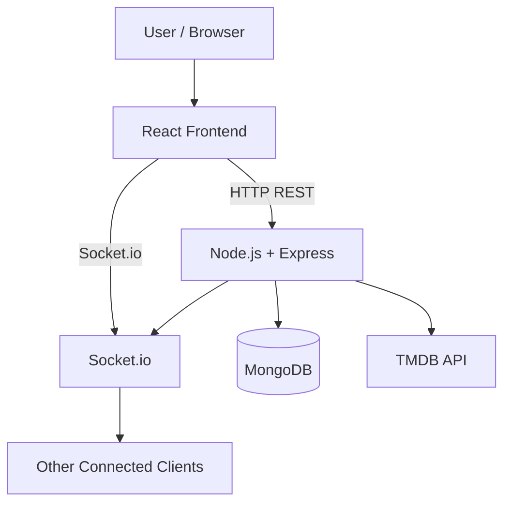

The HTTP and Socket.io paths serve different purposes:

- **REST:** request/response operations and authoritative application state
- **Socket.io:** real-time notifications between clients connected to the same room
- **MongoDB:** persistent source of truth
- **React/Zustand:** client-side representation of the currently relevant state

---

## 3. Core Architectural Principle

The project uses a hybrid REST + Socket.io architecture.

```text
User action
    ↓
REST request
    ↓
Authentication / validation
    ↓
Controller
    ↓
MongoDB state change
    ↓
Socket.io notification
    ↓
Connected clients
    ↓
REST fetch of authoritative state
    ↓
Zustand
    ↓
React UI
```

This deliberately avoids putting the application's business rules inside socket handlers.

A socket event generally means:

> "Something changed."

The REST response/fetch means:

> "Here is the current authoritative state."

This is useful because clients do not need to duplicate match detection, session completion, host authorization, or membership logic.

---

# 4. Backend Architecture

The backend is responsible for:

- Authentication
- Authorization
- Request validation
- Room creation
- Room membership
- Host management
- Session lifecycle
- Movie deck generation
- Swipe validation and persistence
- Match detection
- Session completion
- Session restart
- Real-time notifications

Conceptually:

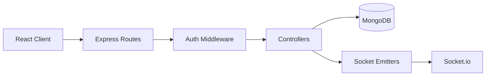

The socket layer remains intentionally thin.

---

# 5. Authentication and Authorization

## 5.1 Authentication flow

CineMatch uses JWT authentication.

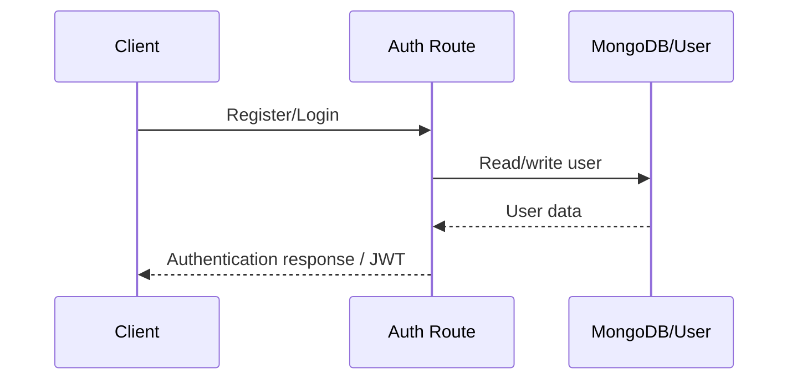

For protected requests:

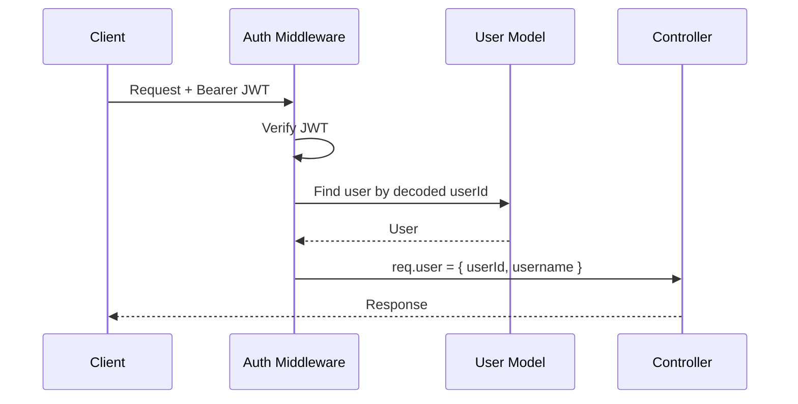

The middleware:

1. Reads the `Authorization` header.
2. Requires the `Bearer` format.
3. Extracts the token.
4. Verifies the JWT using the configured secret.
5. Finds the referenced user.
6. Attaches the authenticated identity to `req.user`.
7. Passes control to the route/controller.

Registration and login are public. Room/session endpoints are protected.

## 5.2 Authorization

Authentication answers:

> Who is making the request?

Authorization answers:

> Is this user allowed to perform this operation?

The controllers verify room membership and host privileges where required.

Examples:

- Only members can access the room/session.
- Only members can submit swipes.
- Only the host can start a session.
- Only the host can restart a session.

---

# 6. Database Architecture

MongoDB is accessed through Mongoose.

The current application has two main models:

- `User`
- `Room`

There is no separate `Session` collection.

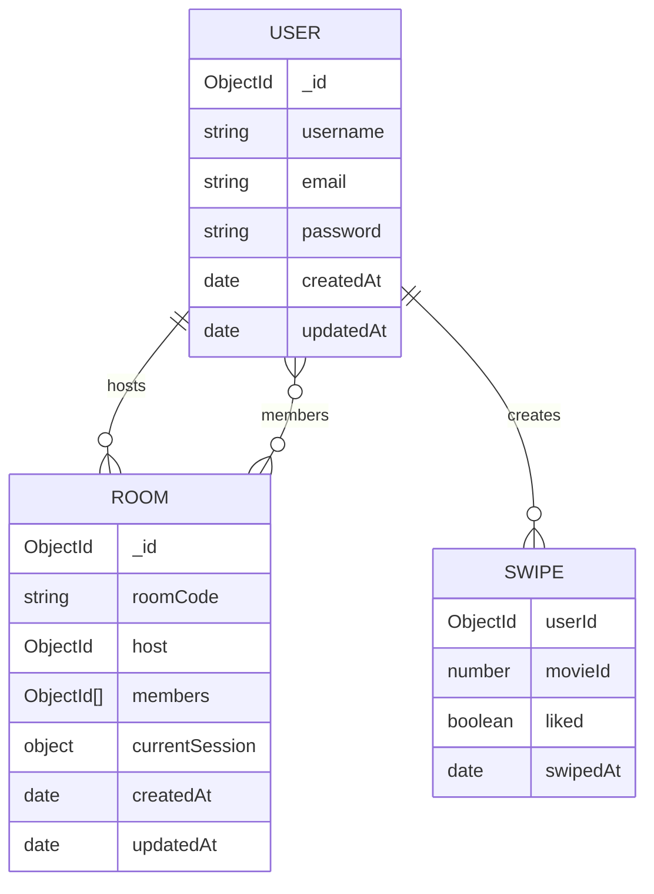

The diagram shows the logical relationships. `SWIPE` is not a separate MongoDB collection; it is an embedded subdocument within `Room.currentSession.swipes`.

---

# 7. User Model

The User document contains:

```text
_id
username
email
password
createdAt
updatedAt
```

Important constraints:

- username is required and has a minimum length
- email is required and unique
- email is normalized to lowercase and trimmed
- password is required
- timestamps are automatically maintained by Mongoose

The user's password is hashed before being persisted.

---

# 8. Room Model

A Room contains:

```text
roomCode
host
members[]
currentSession
createdAt
updatedAt
```

### References

`host` is an ObjectId reference to `User`.

`members` is an array of ObjectId references to `User`.

Users are referenced rather than embedded because users exist independently of any particular room.

Mongoose population is used when user information such as usernames is required.

---

# 9. Current Session Model

The current session is embedded inside Room:

```text
currentSession
├── status
├── movieDeck[]
├── swipes[]
├── matches[]
└── startedAt
```

### Status

```text
waiting
active
completed
```

State flow:

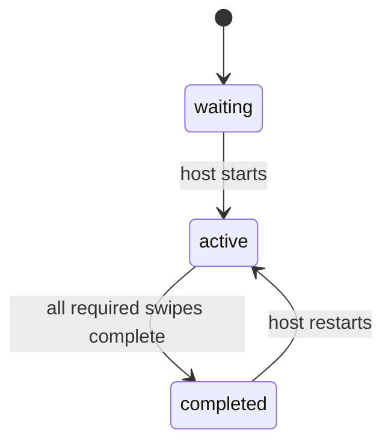

### Why is Session embedded?

CineMatch v1 only needs one current session per room.

Embedding keeps the data model simple and lets the application retrieve the room and its current session together.

This is a scope decision rather than a universal MongoDB rule.

A separate Session collection would become more attractive if the application later needed:

- persistent session history
- many historical sessions per room
- analytics
- independent session queries
- significantly larger session data

---

# 10. Movie Data

Movies are embedded snapshots.

Each Movie contains:

```text
movieId
title
overview
posterUrl
releaseDate
rating
```

Movie subdocuments do not receive their own Mongoose `_id`.

The movie data is stored directly in the current session's:

```text
movieDeck[]
matches[]
```

This allows the current session and its results to contain the movie information needed by the client.

---

# 11. Swipe Data

A Swipe contains:

```text
userId
movieId
liked
swipedAt
```

A swipe represents:

```text
User + Movie + Decision + Timestamp
```

Example:

```text
User A → Movie 101 → Like
User B → Movie 101 → Like
User C → Movie 101 → Dislike
```

Swipes are embedded in:

```text
Room.currentSession.swipes[]
```

The backend validates that:

- the room exists
- the user belongs to the room
- a session is active
- the movie belongs to the current movie deck
- the same user has not already voted on that movie

---

# 12. Room Membership vs Socket Membership

This is one of the most important architectural distinctions in CineMatch.

There are two different types of membership.

## Application membership

Stored in MongoDB:

```text
Room.members[]
```

This determines whether the user is actually a member of the CineMatch room.

## Socket.io membership

Stored in the Socket.io runtime:

```js
socket.join(roomCode)
```

This determines which connected sockets receive broadcasts for a room.

They are independent.

```mermaid
flowchart LR
    User[User] --> REST[POST /rooms/join]
    REST --> Mongo[(Room.members[])]

    User --> Socket[join-room]
    Socket --> SRoom[Socket.io room]
```

Joining a MongoDB room does not automatically join the Socket.io room, and joining a Socket.io room does not create application membership.

The frontend therefore performs both operations.

---

# 13. Socket.io Architecture

Socket.io is used for real-time communication.

The backend initializes one Socket.io server and registers room-specific handlers.

Current client → server events:

| Event | Purpose |
|---|---|
| `join-room` | Join a Socket.io room |
| `leave-room` | Leave a Socket.io room |

Current server → client events:

| Event | Purpose |
|---|---|
| `member-joined` | Room membership changed |
| `member-left` | Room membership changed |
| `session-started` | Session started |
| `session-restarted` | Session restarted |
| `match-found` | A movie became a match |
| `session-completed` | Session voting completed |

The backend emitter conceptually performs:

```text
emitToRoom(roomCode, event, payload)
        ↓
io.to(roomCode).emit(event, payload)
```

The socket layer does not contain the application's core room/session business rules.

---

# 14. Create Room Flow

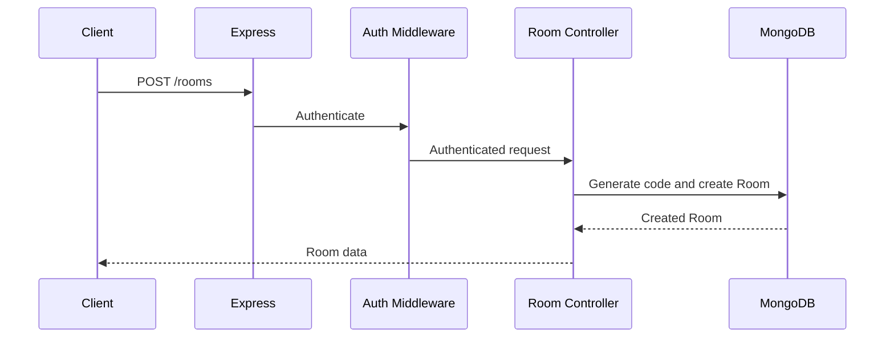

The authenticated user becomes:

- the host
- the first member

The room receives a unique human-facing room code.

---

# 15. Join Room Flow

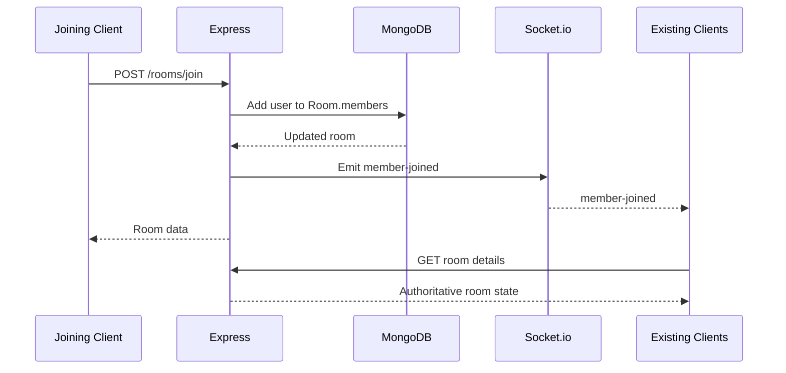

The socket event is a notification. Existing clients fetch room details to update their state from the backend.

---

# 16. Leave Room Flow

The frontend intentionally leaves the Socket.io room before performing the persistent leave operation.

```text
Client
  ↓
leaveSocketRoom(roomCode)
  ↓
POST /rooms/:roomCode/leave
  ↓
MongoDB membership update
  ↓
MEMBER_LEFT broadcast
```

This prevents the leaving client from receiving the broadcast intended for the remaining room members.

The backend handles:

- removing the user
- deleting the room if no members remain
- removing the leaving user's swipes when necessary
- recalculating matches/session state
- transferring host ownership if the host leaves
- emitting `member-left`

Host transfer is therefore handled by the backend rather than the frontend.

---

# 17. Start Session Flow

Only the host can start a session.

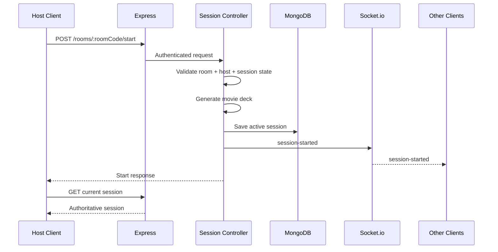

The backend creates the movie deck and persists the session before announcing the change.

---

# 18. Voting Flow

The frontend derives the current movie rather than maintaining a separate movie index.

Conceptually:

```text
currentMovie =
first movie in movieDeck
that current user has not already swiped
```

When a user votes:

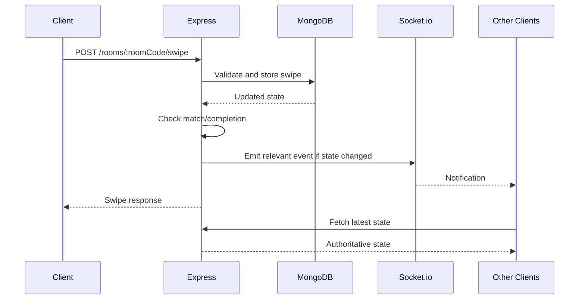

The backend owns validation and state transitions.

---

# 19. Match Detection

For a movie to become a match:

1. Every current room member must have voted on that movie.
2. Every vote must be a like.
3. The movie must not already be stored as a match.

A successful match is stored in:

```text
currentSession.matches[]
```

and the backend can emit:

```text
match-found
```

The frontend does not independently decide whether a movie qualifies as a match.

---

# 20. Session Completion

The backend determines the number of possible swipes as:

```text
movieDeck.length × number of current room members
```

When the recorded swipe count reaches the required total:

```text
currentSession.status = "completed"
```

and:

```text
session-completed
```

is emitted.

The frontend then obtains the latest session state and displays the results.

---

# 21. Restart Flow

Only the host can restart a session.

Restarting:

1. validates the room and host
2. generates a new movie deck
3. resets status to `active`
4. clears swipes
5. clears matches
6. sets a new `startedAt`
7. persists the session
8. emits `session-restarted`

The current architecture does not retain the previous session as historical session data.

---

# 22. Frontend Architecture

The frontend is organized around pages, feature API modules, hooks, socket utilities, Zustand stores, and reusable UI components.

```text
client/src/
├── api/
│   └── axios.js
├── features/
│   ├── auth/
│   ├── room/
│   └── session/
├── hooks/
│   ├── useSocket.js
│   └── useRoomSocket.js
├── pages/
│   ├── LoginPage.jsx
│   ├── RegisterPage.jsx
│   ├── HomePage.jsx
│   └── RoomPage.jsx
├── routes/
│   ├── AppRoutes.jsx
│   └── Protection.jsx
├── socket/
│   ├── socket.js
│   └── events.js
├── store/
│   ├── authStore.js
│   ├── roomStore.js
│   ├── sessionStore.js
│   └── themeStore.js
└── components/
    ├── ThemeToggle.jsx
    └── ui/
        ├── Button.jsx
        ├── Card.jsx
        └── Input.jsx
```

### Responsibilities

**Pages**
- represent route-level UI and coordinate user actions

**Feature API modules**
- isolate HTTP requests from UI components

**Hooks**
- manage reusable lifecycle behavior such as sockets and room listeners

**Socket utilities**
- initialize/use Socket.io and define event names

**Zustand stores**
- hold currently relevant client-side authentication, room, session, and theme state

**UI components**
- provide reusable presentation primitives

---

# 23. Frontend State Management

The main application stores are:

### authStore

Authentication/user state.

### roomStore

Current room state.

```text
room
setRoom()
clearRoom()
```

### sessionStore

Current session state.

```text
session
setSession()
clearSession()
```

### themeStore

Light/dark theme preference.

The theme preference is persisted in localStorage.

---

# 24. Why Current Movie Is Derived

The application does not maintain:

```text
currentMovie
movieIndex
```

as separate persistent client state.

Instead, the current movie is derived from:

```text
session.movieDeck
+
session.swipes
+
current user ID
```

This avoids maintaining two potentially conflicting representations of voting progress.

If the backend session state changes, the frontend can recompute the current movie from the latest state.

---

# 25. Frontend Socket Lifecycle

`useSocket` manages the application-level Socket.io connection.

The socket connects while the authenticated application is active and disconnects when it is no longer needed.

`useRoomSocket` handles room/session event listeners:

```text
member-joined
member-left
session-started
session-restarted
match-found
session-completed
```

Event callbacks generally retrieve the latest room/session state through REST and update Zustand.

---

# 26. Routing

Current routes include:

```text
/
    → /home

/login
/register

Protected:
/home
/room/:roomCode
```

The protected routes use a route protection component so unauthenticated users cannot access room/application pages.

---

# 27. REST + Socket Synchronization

The synchronization strategy can be summarized as:

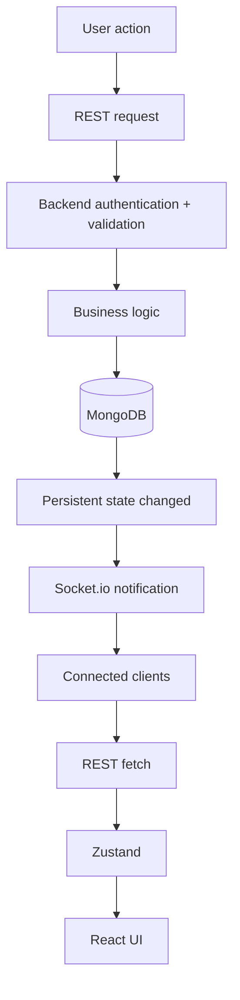

### Why this design?

It centralizes business rules in the backend.

For example, the frontend does not need to know how to:

- determine whether everyone voted
- determine whether a movie is a match
- determine whether the session is complete
- transfer host ownership
- validate room membership

This reduces duplicated logic and makes the backend the consistent authority.

---

# 28. API Reference

## Authentication

```text
POST /api/auth/register
POST /api/auth/login
```

These endpoints establish authentication.

## Rooms

```text
POST /api/rooms
POST /api/rooms/join
GET  /api/rooms/:roomCode
POST /api/rooms/:roomCode/leave
```

## Sessions

```text
POST /api/rooms/:roomCode/start
GET  /api/rooms/:roomCode/session
POST /api/rooms/:roomCode/swipe
POST /api/rooms/:roomCode/restart
```

Room/session routes are protected by JWT authentication.

Exact request and response schemas should be maintained alongside the route validators/controllers.

---

# 29. Socket Event Reference

| Direction | Event | Meaning |
|---|---|---|
| Client → Server | `join-room` | Join Socket.io room |
| Client → Server | `leave-room` | Leave Socket.io room |
| Server → Clients | `member-joined` | Application membership changed |
| Server → Clients | `member-left` | Application membership changed |
| Server → Clients | `session-started` | Session became active |
| Server → Clients | `session-restarted` | New session started |
| Server → Clients | `match-found` | Movie became a common match |
| Server → Clients | `session-completed` | All required voting completed |

---

# 30. Important Design Decisions

## 30.1 REST + Socket.io

**Decision:** Use REST for application operations and Socket.io for real-time notifications.

**Why:** REST is straightforward for request/response operations and persistent state, while Socket.io provides low-latency room communication.

**Tradeoff:** Clients may perform an additional REST fetch after receiving a socket event.

---

## 30.2 Backend as source of truth

**Decision:** Business logic and authoritative state live on the backend.

**Why:** Prevents clients from independently reaching different conclusions about room/session state.

**Tradeoff:** Real-time events can require another API request to obtain the latest state.

---

## 30.3 Thin socket layer

**Decision:** Keep socket handlers focused on communication.

**Why:** Avoids duplicating business rules between REST and Socket.io paths.

**Tradeoff:** Socket events are less self-contained because clients may need to fetch current state.

---

## 30.4 Embedded current session

**Decision:** Embed the current session in Room.

**Why:** One current session per room is sufficient for v1.

**Tradeoff:** The Room document grows with session data and is less suitable for very large or historical session datasets.

---

## 30.5 Referenced users

**Decision:** Store User ObjectIds in Room.

**Why:** Users exist independently and can participate in rooms without duplicating their user records.

**Tradeoff:** User details require population/lookup when needed.

---

## 30.6 Derived current movie

**Decision:** Derive the current movie from the session and current user's swipes.

**Why:** Avoids an additional source of truth for voting progress.

**Tradeoff:** Derivation happens on the client whenever session state changes.

---

# 31. Scalability

## 31.1 What scales reasonably well in the current design

The architecture has useful foundations for a small-to-moderate deployment:

- HTTP operations are separated from real-time communication.
- MongoDB provides persistent shared state.
- Socket.io provides room-based communication.
- Business logic is centralized in the backend.
- The frontend does not need to maintain authoritative session state.
- The application does not unnecessarily split into multiple services.

## 31.2 Current boundaries

The current version is not designed as a distributed production system.

Potential boundaries include:

### Embedded session/swipes

`currentSession.swipes[]` is part of the Room document.

As room sizes and movie decks grow, this document can become larger and more frequently updated.

### Single Socket.io process

The current socket implementation does not introduce a distributed Socket.io adapter.

If multiple backend instances were deployed, Socket.io room state/notifications would need a shared adapter or equivalent coordination mechanism.

### External TMDB dependency

Movie deck generation depends on the external movie service being available and responsive.

### No dedicated cache

The current architecture does not include a Redis/cache layer.

### No session history

Only the current session is represented inside the Room.

These are scaling boundaries, not reasons the v1 architecture is incorrect.

---

# 32. Possible Production-Scale Evolution

If CineMatch grew substantially, the architecture could evolve toward:

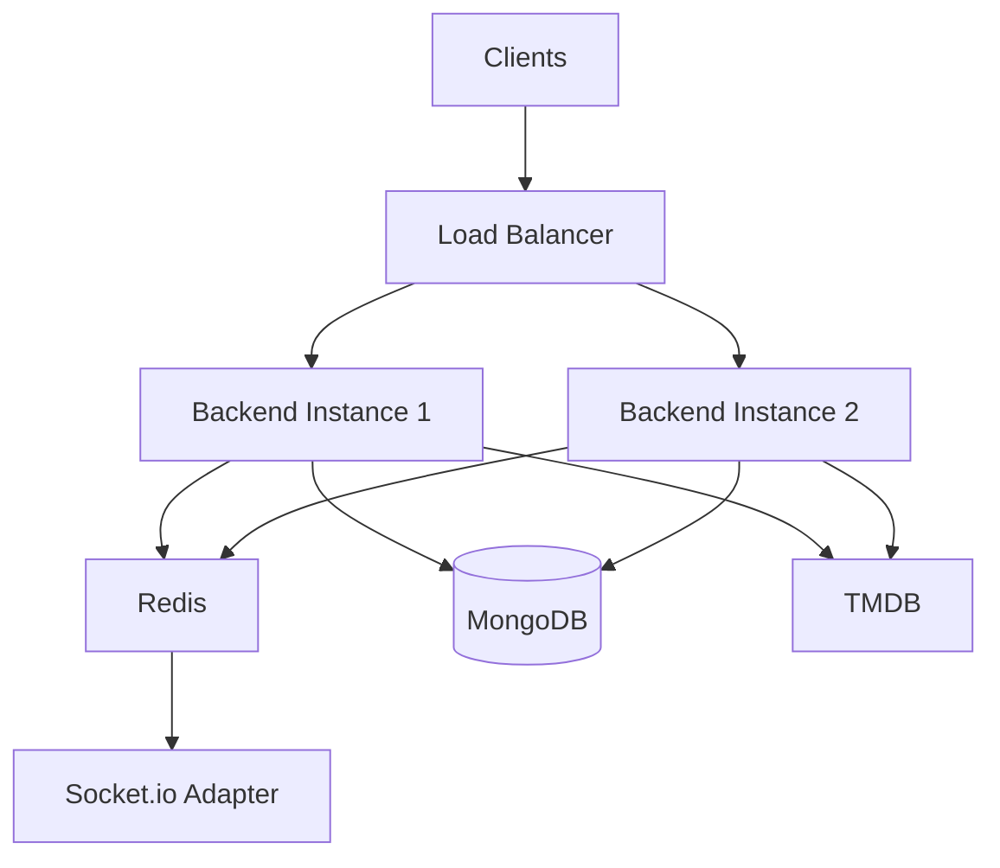

Potential changes:

- Redis-backed Socket.io adapter
- horizontal backend scaling
- caching
- separate Session collection
- potentially separate Swipe collection for high-volume workloads
- rate limiting
- structured logging
- health checks
- monitoring and metrics
- stronger production CORS configuration
- automated deployment/testing

These are future possibilities, not part of the current CineMatch v1 implementation.

---

# 33. Security Considerations

Current protections include:

- JWT authentication
- password hashing
- protected routes
- room membership checks
- host authorization
- input validation
- duplicate swipe prevention
- Mongoose schema validation

The current Socket.io CORS configuration is permissive for development and should be restricted to the deployed frontend origin before public deployment.

Secrets such as JWT secrets, database credentials, and TMDB credentials should be supplied through environment variables and must not be committed to source control.

---

# 34. Deployment Target

The intended first public deployment does not require distributed infrastructure.

A simple deployment can use:

```text
                    Internet
                       │
                       ▼
                React Frontend
                       │
                   HTTPS/WSS
                       │
                       ▼
                Node + Express
                  + Socket.io
                    │     │
                    ▼     ▼
                 MongoDB  TMDB
```

The deployment goal is a working public demonstration rather than production-scale infrastructure.

Before deployment, the application should:

- replace localhost dependencies with environment-based URLs
- configure production API/socket URLs
- configure production environment variables
- restrict CORS to the frontend domain
- use a hosted MongoDB instance
- verify Socket.io works over the deployed connection
- test multiple browsers/devices against the public deployment

---

# 35. Testing Strategy

The MVP was developed incrementally and manually tested using multiple browser clients.

Important flows tested include:

- registration/login
- protected routes
- room creation
- joining
- leaving
- member synchronization
- session start
- movie voting
- match detection
- session completion
- session restart
- host behavior

React development mode can cause effects to be invoked more than once under StrictMode. Development logs should therefore not automatically be interpreted as evidence of duplicate production behavior.

---

# 36. Current Scope vs Future Scope

## Current v1

- Full authentication flow
- Room creation/join/leave
- Real-time member synchronization
- Host-controlled sessions
- Movie voting
- Match detection
- Session completion
- Restart
- Basic polished UI
- Light/dark theme

## Future

- Historical sessions
- Match history
- Personalized recommendations
- Redis/distributed Socket.io
- Horizontal backend scaling
- Caching
- Advanced observability
- More comprehensive automated tests

The distinction is intentional: v1 prioritizes a complete, understandable end-to-end product over infrastructure complexity.

---

# 37. Key Interview/Viva Explanation

A concise description of the architecture:

> CineMatch uses a hybrid REST and Socket.io architecture. REST handles authenticated application operations and persistent state changes, while Socket.io provides real-time notifications to clients in the same room. MongoDB is the authoritative data store, and the backend owns the business logic for membership, session state, swipes, matches, and completion. When a state-changing operation occurs, the backend persists it and emits a socket event; clients can then fetch the latest authoritative state through REST and update their local Zustand state.

A concise explanation of the embedded session:

> A separate Session collection was not necessary for v1 because each room only needs one current session. Embedding the current session keeps the model simple and makes the current room/session state easy to retrieve together. A separate collection would make more sense if persistent session history or many sessions per room became requirements.
